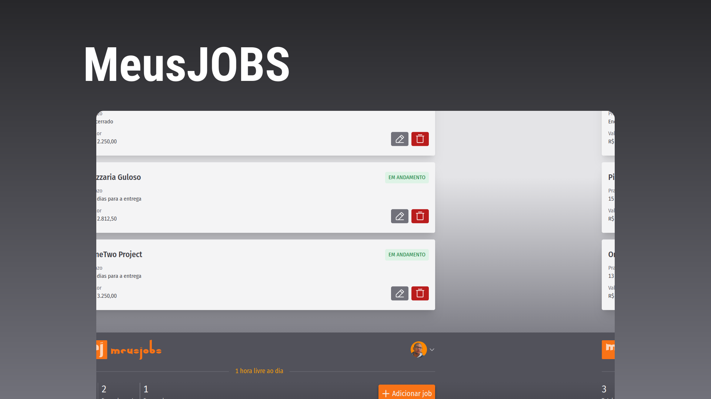

<h2>Site published <a href="http://meusjobs.vercel.app/">here</a></h2>

## Technologies

This project was developed with the following technologies:

<ul>
  <li>React</li>
  <li>Firebase</li>
  <li>TailwindCSS</li>
  <li>PhosphorReact</li>
  <li>Typescript</li>
  <li>ViteJS</li>
</ul>

## Project

  Aplicação de estimativa de cálculo para projetos freelancer, onde é possível cadastrar e excluir "jobs", obtendo uma estimativa de custo de cada job. Além disso, é possível traçar o valor da hora da pessoa que estará usando o sistema.! 

  Calculation estimation application for freelance projects, where it is possible to register and exclude "jobs", obtaining a cost estimate for each job. In addition, it is possible to plot the hourly value of the person who will be using the system.! 

**
Personal project
**
